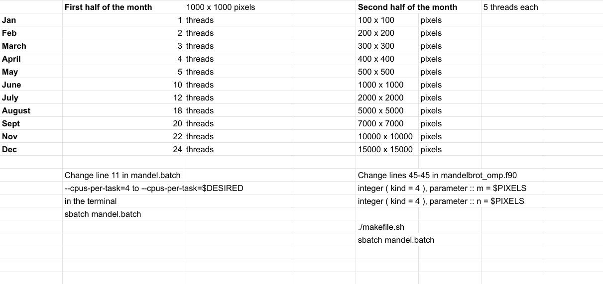

# Talapas_Tutorial
# Logging into Talapas 

To log onto the Talapas Cluster open up a terminal window 

and type the command 

`ssh -Y duckid@talapas-login.uoregon.edu` 

`ssh` is the Secure Shell and will access the Talapas Cluster over the internet, the cluster is called the "Remote" sever. The `-Y` option will allow you to open GUI and forward this to your "Local" machine. 

If my email was ducky@uoregon.edu then my login for talapas would look like this:

`ssh -Y ducky@talapas-login.uoregon`

 It will require your DUCKID password.

If this is the first time logging onto Talapas, it will ask if you want to add this address 

``` 
The authenticity of host 'talapas-ln1 (129.242.2.68)' can't be established.
RSA key fingerprint is SHA256:KEY
Are you sure you want to continue connecting (yes/no)?
```
Say yes. 

After logging in it will look like this: 
```
# Welcome to Talapas!
# Data on Talapas is NOT backed up. Data management is each users responsibility.

# Need support? Please visit the Talapas Knowledge Base:
# https://hpcrcf.atlassian.net/wiki/spaces/TCP/overview

# Storage usage in GB as of Thu Feb 18 12:01:04 2021

Fileset          User             UsedByUser  UsedByAll      Quota  Use%

```

And then give statistics about your storage usage. 

Let's make a new directory for this tutorial. 


We are currently in a HEAD node. Nodes are individual servers in the cluster. We do not want to do any large computations in the head node which will clog the system for anyone else logging in.  

We will initiate an interactive session, interactive sessions are allow you to work on compute nodes. Using an interactive session is necessary for task that take longer than  per  Talapas guidlines. For example: 

- compiling code 
- opening matlab
- running post processing 

However, things like `ls` looking at directories etc do not require a compute node. 

The command we will use to launch any session on a compute node is `srun` a specific SLURM command. 
The command we will use for the WiHPC tutorial is 

`srun --account=wihpc --x11 --partition=short --reservation=wihpc --pty bash`

If you are trying this on your own, the reservation will not be active so just use the command 

`srun --account=wihpc -x11 --partition=short --pty bash`

The `-X11` will allow for forwarding of any windows you open.

It will ssh you into a compute node. Note that the prompt will change from `user@talapas-ln1 $` to `user@n049` where n049 means you are on node 49. 


We can now use another SLURM command to see what jobs we are running. 

`squeue -u USER`

The `-u` option is for user and outputs the jobs you are running as a user. 

For example if your username is ducky, you would run `squeue -u ducky` 

will show the jobs you are running and you will see the interactive session you just started. 

```
 JOBID PARTITION     NAME     USER   ST       TIME  NODES NODELIST(REASON)
14198989     short     bash    ducky  R       2:37      1 n049
```

We can also check the other people running on the *short* paritition by using the command 

`squeue -p short` 

The option `-p` is for partition. If you are running this during the tutorial you should see the tutorial participents running here. 

First off, let's make a new directory for this tutorial. We care going to copy the code from the `/projects/wihpc/shared` directory. All the PIRGs have a folder in the `/projects` directory. You will also have a folder under `/projects/wihpc/user`. If my user name was ducky, my directory would be `/projects/wihpc/ducky`. 

Your `/projects` directory has more alloted storage than the home directory so in the future if you work on Talapas it is generally best to work from this directory. 

Let's change into that directory. 

`cd /projects/wihpc/ducky`
But please sub in your own user name.

Then we are going to copy the directory `/projects/wihpc/shared/feb_tutorial`
into our own folder. 

`cp -R /projects/wihpc/shared/feb_tutorial  ./`

This command recursively copies the feb_tutorial folder into your own folder. 


`cd feb_tutorial`

## Using srun 
Open up the file `testNodes.sh` using `nano`. What does it do? 

Try running it using srun. srun is a command to run parallel jobs. 

`srun --account=wihpc --partition=short --reservation=wihpc -N2 testNodes.sh`

Like we did before, we have to state the account, partition, and reservation. But before we started a bash instance and here we will run the testNodes.sh file. Another difference is that we specified the number of nodes using `-N2` meaning we want 2 nodes. 

If it doesn't run immediately, check the queue and see if there are a lot of jobs inline. 

Congrats on running something for the first time on super computer cluster!!

## Mandelbrot set 

Change directory into `/feb_tutorial/mandelbrot`.

This contains code to calculate the [Mandelbrot Set](https://en.wikipedia.org/wiki/Mandelbrot_set). Wikipedia says that the set is 

> infinitely complicated boundary that reveals progressively ever-finer recursive detail at increasing magnifications, making the boundary of the Mandelbrot set a fractal curve.


We will first open up the bash script `makefile.sh`. Take a moment to look at the code. For larger codes it is common to use a script to manage the compilation called a makefile or make etc. 

It uses the gfortran compiler to make an executable called `mandelbrot.exe`.

Run the code in your terminal first compile it using 

`./makefile.sh` or `sh makefile.sh`

We can run the code in the terminal using 

`./mandelbrot.exe`

This works pretty well. It should take about 1.7s. 

But if we want to run it at higher resolution it will take longer. So we want to parallelize it. 

We will run it using `sbatch`. 

Using sbatch we will need to specify the number of cores, number of nodes, the account, the reservation the same as `srun` but instead of putting it in one command we put it in the batch script which is a bash script file. 

Open the file `mandel.batch` using nano.

It is formatted like 

```
#!/bin/bash

#SBATCH --partition=short     ### Partition/queue name specific to our group
#SBATCH --job-name=mandelbrot  ### Job Name -- can make this specific to your program
#SBATCH --output=mandel.out   ### file in which to store job stdout, edit for a your case
#SBATCH --error=error.err    ### file in which to store job stderr, edit for your case
#SBATCH --time=00:010:00      ### WallTime (maximum running time)
#SBATCH --nodes=1           ### Number of Nodes
#SBATCH --ntasks-per-node=1         ### Number of Tasks
#SBATCH --cpus-per-task=5
#SBATCH --account=wihpc 
#SBATCH --reservation=wihpc   ### Reservation for tutorial


module load intel/17
module load openmpi
module load mkl

mpirun -np 1 ./mandelbrot.exe
```
The `#SBATCH` tells the sbatch command to read this line where as the `#` is a comment. Then after the `#SBATCH` there is the code that is actually run. The module load lines load the code necessary for the program to run like an import statement like used in python. 

This program will run on one node and use 5 processors (cores).

The mpirun command at the end is a specific command for the parallelization used in the fortran program and acts similarly to srun. 

This batch file is the same as if you added all those options to the srun command.


You can submit it to the queue using:

`sbatch mandel.batch`

Use `squeue -u user` to check the status.

You can also open up the `mandel.out` file using `nano` to check the output of the code. If there are errors it will show in `error.err`

How much faster is this than running on one core? 

We can check the output of the code using 

`display mandelbrot_openmp.ppm`


There you go a new desktop background! 

## Canceling a run 

TO cancel a run first check the jobid using `squeue -u USER`

It will print a job id that is 9 digits. You can then cancel a run using `scancel JOBID`


## How much faster?

We are going to each act  "in parallel" and check the speed up in this program. 



Report the time it took to run to Allison and we will put together a speed up graph!


## Matlab example

We will run the matlab example in two ways. First we will run it on the compute node then using the `sbatch` command. 

On a compute node we can run programs directly and get the output on the compute node. However, first we need to load Matlab. 
The command to load matlab or any module is 

`module load matlab` 

We can open matlab using the command

`matlab &` which opens a matlab GUI window. This is somewhat slow and if  you want the use GUI windows it is recommend to do so using [OpenOnDemand](https://hpcrcf.atlassian.net/wiki/spaces/TCP/pages/922746881/Open+OnDemand).

`matlab -nodisplay -nosplash -nodesktop` which opens the CLI interface. Try typing a few matlab commands.

Type 'exit` to close the CLI instane. 

Then we can use CLI matlab to run the code. 

`matlab -r "try, run('./script.m'), catch, exit(1), end, exit(0);" -nodisplay -nosplash -nodesktop`

It will tell us that 
```
task_id =

    '0'
```
This is not running parallel. To run in parallel we need to use the `sbatch` command. This will allocate the nodes we need for it. 

Open the file `matlab_ex.batch` and check the settings. 

You can run it using 

`sbatch matlab_ex.batch`
